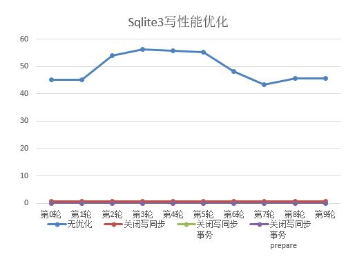

# Sqlite3 写性能优化测试

## 0 起因

在项目中，发现 `Sqlite3` 的写性能非常差，参考[网上资料](https://blog.csdn.net/Ango_/article/details/122074816)尝试进行优化。

思路：

- 关闭写同步：Sqlite3 的写同步方式有三种：FULL, Normal 和 OFF。
  - FULL：安全级别最高，程序意外崩溃时保证数据不损坏，性能最低
  - OFF 比 FULL 模式至少快一个数量级

- 使用事务：默认情况，每插入一条数据，数据库会 `commit` 一次，导致频繁的磁盘IO。使用事务，可以插入多条，然后一次性 `commit`。

- prepare stmt：提前准备 `sql` 语句，盛趣每次插入时的 `sql` 语法检查等操作，可大幅提升语句执行的效率。

## 1 结论

> 每种优化方案执行 `10` 轮，每轮执行 `1000` 次插入，时间单位：秒

||无优化|关闭写同步|关闭写同步 & 事务|关闭写同步 & 事务 & prepare stmt|
|:-:|:-:|:-:|:-:|:-:|:-:|
|第0轮	|45.07	|0.74	|0.019	|0.0016 |
|第1轮	|45.23	|0.58	|0.009	|0.0016 |
|第2轮	|53.98	|0.57	|0.009	|0.0015 |
|第3轮	|56.15	|0.59	|0.01	|0.0013 |
|第4轮	|55.78	|0.63	|0.011	|0.0015 |
|第5轮	|55.26	|0.57	|0.009	|0.0015 |
|第6轮	|48.15	|0.57	|0.009	|0.0016 |
|第7轮	|43.42	|0.58	|0.009	|0.0015 |
|第8轮	|45.69	|0.59	|0.009	|0.0015 |
|第9轮	|45.51	|0.76	|0.009	|0.0015 |
|平均	|49.424	|0.618  |0.0103	|0.00151|

结论：
- 关闭写同步，相比无优化的性能，提升近100倍
- 再使用事务，性能又提升50倍
- 再prepare stmt，性能又提升10倍